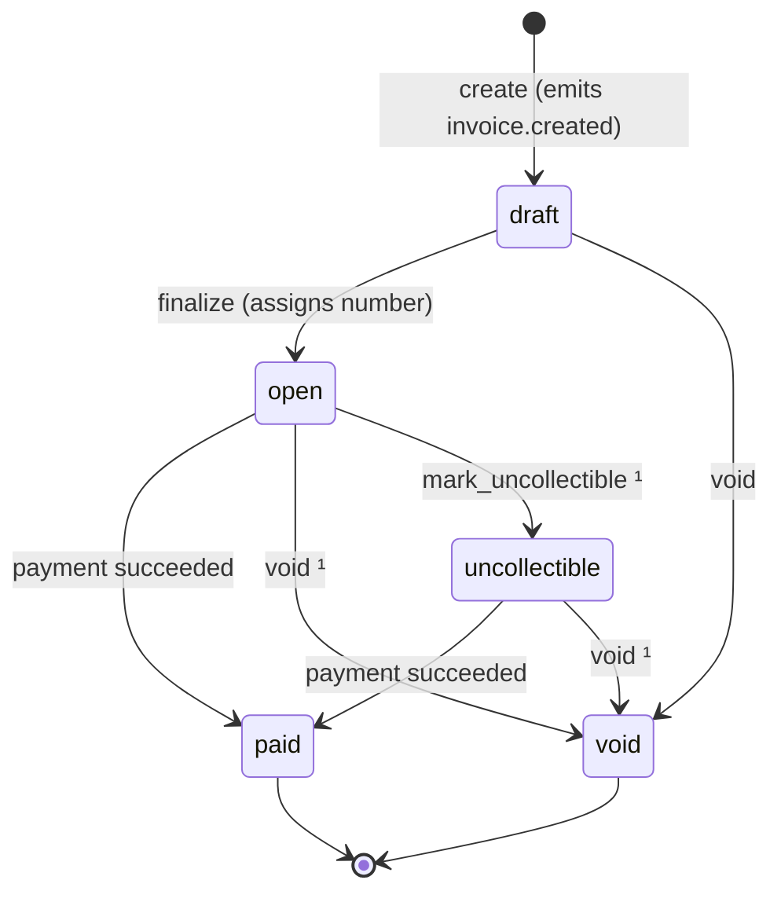

# DESIGN.md — Invoice & Payment Service

## 0. Context and goals

Businesses invoice customers, customers pay through a PSP, and businesses are notified by webhooks. **Goals:** no double charges, invoice state never contradicts the PSP, integer money, webhooks never lost or blocking. **Non-goals:** refunds, partial payments, multi-currency, tax, subscriptions.

**Architecture.** One Go service (HTTP API plus two in-process workers), a mock PSP as a separate binary, and PostgreSQL. There's no queue or cache: Postgres *is* the queue, via a transactional outbox claimed with `SKIP LOCKED`. Migrations run on startup, and every migration has a working down file. A small webhook receiver in compose logs deliveries and verifies their signatures; it's demo tooling, not product.

```
client ──HTTP──> api ──┬──> PostgreSQL <──┬── reconciler (polls pending payments, every 5s, configurable)
                       │                  └── webhook dispatcher (polls outbox) ──signed──> business endpoint
                       └──HTTP, 5s timeout──> mock PSP (own schema)
```

## 1. Data model

**IDs.** All IDs are UUIDv7, generated in the app.
- **UUIDv4** was rejected: it's random, so inserts scatter across the B-tree and there's no natural order for pagination.
- **Snowflake** was rejected: it's compact and ordered, but every instance needs a unique worker ID, which means coordination for each new service.
- **UUIDv7** is time-ordered (local inserts, `ORDER BY id` = newest first, so keyset pagination needs no `created_at` index), needs no coordination, and isn't guessable.

**Money** is `BIGINT` cents. `CHECK` constraints mirror the app's invariants as a second line of defence.

| Table | Shape (key columns) | Indexes / constraints | Why | At 100x |
|---|---|---|---|---|
| `businesses` | name | PK | Tenant root | No change; tiny, rarely written |
| `api_keys` | `prefix`, `key_hash`, `revoked_at` | `UNIQUE(key_hash)` | One lookup per request | Short-TTL cache |
| `customers` | name, email | `(business_id, id DESC)`, `UNIQUE(business_id, id)` | Target of the tenant-safe FK | Partition by business |
| `invoices` | status, `total_cents`, `due_date`, `invoice_sequence_number`, `latest_payment_attempt_id`, `paid_at` | `(business_id, status, id DESC)`, `(business_id, id DESC)`, FK `(business_id, customer_id)` | The FK makes cross-tenant references impossible even if the app has a bug | Read replica for lists |
| `invoice_line_items` | qty, unit, amount, `position` | `UNIQUE(invoice_id, position)`, `CHECK(amount = qty × unit)` | The DB re-verifies the arithmetic | Partition with invoices, or JSONB on the invoice (immutable after create) |
| `invoice_number_sequences` | `(business_id, fiscal_year)` → `prefix`, `last_value` | PK | Gap-free counter | Separate series per document type; contention stays per business |
| `invoice_transitions` | from, to, reason, attempt_id (append-only) | `(invoice_id, id)` | Audit without mutating history | Monthly partitions |
| `invoice_payment_attempts` | `payment_ref_id`, status | **partial unique `(invoice_id) WHERE status='pending'`** | DB-enforced: one in-flight payment per invoice | Partition by month with invoices |
| `payments` | `payment_ref_id` (PK, the PSP idempotency key), `psp_ref_id`, amount, status, `resolved_at` | partial `(created_at) WHERE status='pending'` | Domain-agnostic money record; reconciler scans only in-flight rows | Own service, emitting events |
| `invoice_payment_idempotency_keys` | `(business_id, key)` → `request_hash`, `attempt_id` | PK | Written in the same transaction as the attempt | TTL purge |
| `webhook_endpoints` | url, secret, `disabled_at` | `(business_id) WHERE disabled_at IS NULL` | Few rows per business | Dispatcher caches active endpoints per business |
| `webhook_deliveries` | `id` (PK), `event_id`, `endpoint_id`, type, JSONB snapshot, status, `attempt_count`, `next_attempt_at` | `UNIQUE(event_id, endpoint_id)`, partial `(next_attempt_at) WHERE status='pending'` | One row per (event, endpoint), so each endpoint retries independently; the poll touches only due rows | Outbox feeds SQS/Kafka |

**Totals.** One pure function, `ComputeTotals` (overflow-checked), computes every line amount and the total. The client sends `expected_total_cents`, i.e. what it displayed. A mismatch returns `422 total_mismatch`, and the client value is never stored. The same function would back a preview endpoint, so the UI and the server can't disagree.

**Invoice numbers.** Numbers like `INV-000042/26-27` are assigned at **finalize**, so drafts never consume one. They're consecutive and unique per business per financial year, at most 16 characters from `[A-Za-z0-9/-]`, matching India's CGST Rule 46(b). The financial year runs April to March and its boundary is judged in `Asia/Kolkata` (configurable), so an invoice finalized just after midnight on 1 April IST belongs to the new year even while UTC is still 31 March. The counter row is incremented inside the finalize transaction, so a rollback leaves no gap. Six digits is all the 16-character format holds; a business that exhausts a year's 999,999 numbers fails the finalize (a `CHECK` on the counter) instead of producing a malformed number. A Postgres `SEQUENCE` was rejected: it isn't gap-free or per-business.

**Tenant scoping for payments.** `payments` and `invoice_payment_attempts` carry no `business_id` (payments is domain-agnostic). Every read of them joins `invoices` and filters on `invoices.business_id`, so another business's attempt returns 404.

**No hard deletes.** Financial records are immutable; the end of an object's life is a state (`void`, `revoked_at`, `disabled_at`).

## 2. Invoice state machine


¹ Rejected with `409 payment_in_progress` while an attempt is pending.

- **Terminal states:** `paid`, `void`. **Payable from:** `open`, `uncollectible`.
- **A decline is an event, not a state.** The invoice keeps its state, and `invoice.payment_failed` is emitted.
- **Reversibility:** nothing is undone. `uncollectible → paid` is the one path away from "written off", and it's deliberate, because a late payment is still owed. Drafts aren't editable (void and recreate).
- **Rejection:** the allowed transitions live in one table in code. Every change locks the invoice row, checks the table, updates `WHERE status = <expected>`, and writes a transition row, all in one transaction. Invalid transitions return `409 invalid_transition` naming the current state.
- **Why no `processing` invoice state:** "in flight" belongs to the *attempt*. Putting it on the invoice would add transitions and make the reconciler move invoice state for mechanical reasons.

## 3. Payment correctness and failure modes

**The pay flow.**
0. **Validate before locking:** the `Idempotency-Key` header (`400 idempotency_key_required`; over 255 characters is `422 validation_failed`), then the body (`400` malformed, `422` invalid fields), so bad requests never take a row lock.
1. **Reserve (tx1):** lock the invoice `FOR UPDATE` (404 if it isn't this business's); replay the idempotency key if it exists; check it's payable (`409 invalid_transition`), nothing is pending (`409 payment_in_progress`), and `amount_cents` equals the total (else `422 amount_mismatch`), in that order. Insert the payment and attempt (`pending`) and the idempotency key, set `latest_payment_attempt_id`, and commit.
2. **Call the PSP** (connect 2s, total 5s) with `Idempotency-Key: payment_ref_id`. **No transaction is open during the call.**
3. **Resolve (tx2):** update the payment and attempt `WHERE status = 'pending'`; transition the invoice only if this attempt is still its latest; write the transition row; enqueue the webhook.

**Concurrency mechanism: row-level lock plus partial unique index plus status-conditional updates.** The lock serializes everything touching one invoice. The index enforces one pending attempt even if some path forgets the lock. The conditional updates make every resolution apply at most once. Rejected alternatives:
- *Advisory locks* live outside the data and are easy to miss on a new code path.
- *Optimistic versioning* turns a hot invoice into retry storms.
- *SERIALIZABLE isolation* aborts whole transactions and pushes retries into every caller.

The lock is held for milliseconds, never across the network.

**(a) Two simultaneous `POST /pay` calls on one invoice.** Both block on `FOR UPDATE`. The first inserts a pending attempt and commits; the second then sees it and gets `409 payment_in_progress`. Exactly one PSP charge is made. With the *same* idempotency key, the second finds the committed key and returns the first attempt's current state: 202 while it's pending, 200 once it has resolved.

**(b) PSP timeout (`tok_timeout`).** The client gives up at 5s, and the endpoint returns **202** with the attempt (`pending`). The payment and attempt stay `pending`, and the invoice stays `open`. **A timeout means "unknown", never "failed";** the PSP is the only source of truth. The reconciler calls `GET /charges/{payment_ref_id}`: `processing` means wait, and a definitive result resolves the attempt (about 35s for `tok_timeout`). The caller learns the outcome from `GET /payment_attempts/{id}` or from the `invoice.paid` / `invoice.payment_failed` webhook. The reconciler only picks up payments older than the PSP total timeout (5s), so the inline call owns a payment until its own timeout; this decides *when to query*, never the outcome. It reads with a plain `SELECT` (no `FOR UPDATE SKIP LOCKED`, which would hold a transaction across a network call); the `WHERE status = 'pending'` update makes concurrent reconcilers and the inline path safe. If the PSP has no record of the charge, the payment stays pending, is retried on every poll, and is logged at warn (alerting is in section 7). Failure is never inferred from elapsed time. The cost: while the PSP is unreachable, the invoice stays blocked (no pay or void), which is why alerting is the first production gap.

**(c) The PSP charged, but we crashed before saving.** The payment row was committed as `pending` *before* the call, so the reconciler finds it, requeries, and resolves it to paid. A client retry with the same key returns that attempt; one with a new key gets 409 while it's pending. The PSP deduplicates on `payment_ref_id`. **No double charge.** The mock's `tok_network_error` reproduces this case: it processes the charge, *then* drops the connection.

**(d) Same key, different body.** `422 idempotency_key_reused`, based on a SHA-256 of the canonical request (invoice ID plus body). The key is written in tx1, so a request that fails validation leaves no key and a retry recomputes the same error. No "in progress" state is needed, because the invoice lock serializes same-key requests.

**(e) `POST /pay` on a paid invoice.** The idempotency check runs first: replaying the key that paid it returns that successful attempt (200, no PSP call). A new key reaches the state check and gets `409 invalid_transition`.
## 4. Webhook design

- **Signing:** the Standard Webhooks scheme, with HMAC-SHA256 over `"{webhook-id}.{webhook-timestamp}.{raw body}"` using a per-endpoint secret (`whsec_…`, shown once at registration). It's sent as `webhook-signature: v1,<base64>` with `webhook-id` and `webhook-timestamp`.
- **Replay protection:** receivers reject timestamps older than 5 minutes and deduplicate on `webhook-id`, which is stable across retries.
- **Payload:** `{id, type, created_at, data.object}`, where `object` is an invoice snapshot taken at event time, in the same shape as `GET /invoices/{id}`.
- **Decoupled from the API:** the outbox row is inserted in the **same transaction** as the state change, so an event exists if and only if the change committed. The dispatcher claims due rows with `FOR UPDATE SKIP LOCKED`. The API never calls out for webhooks.
- **Fan-out:** a business may register several endpoints. Each event is written as one delivery row per active endpoint, in the same transaction. Rows share `event_id` (the `webhook-id` header) but retry independently, and each is signed with its endpoint's own secret. No active endpoint means no rows. Endpoints registered later don't receive past events; rows whose endpoint is disabled mid-retry are not attempted.
- **Retries:** immediate, then 30s, 2m, 10m, 1h, 6h, 12h (±20% jitter): **7 attempts over about 19.7 hours**. Each request has a 5s timeout, and only a 2xx counts. Delivery is at-least-once; ordering is not guaranteed.
- **Exhausted budget:** the delivery is marked `failed` and kept. *Documented, not built:* the endpoint auto-disables after 5 consecutive exhausted deliveries, and the business re-enables it and requests redelivery.
- **Missed events:** webhooks are notifications, not the source of truth. A business can always rebuild state from `GET /invoices?status=…` and `GET /invoices/{id}`.

## 5. API key model

- **Generation:** `sk_test_` + 32 bytes from `crypto/rand`, shown once. Seeded on startup. Compose sets `DEMO_API_KEY` so the README examples work as-is; that's for local development only, and without it the seed generates a random key.
- **Storage:** only the SHA-256 hash plus a display prefix. A fast hash is safe because the key is 256-bit random. A salted slow hash would make lookup by key impossible.
- **Transmission:** `Authorization: Bearer`, over TLS terminated at the load balancer. Keys are never logged.
- **Tenancy:** the middleware puts `{business_id, api_key_id}` in the request context. `business_id` is never accepted from the request, and services take it as an explicit parameter.
- **Rotation:** many active keys per business, so rotation is create, deploy, revoke, with no downtime.
- **Revocation:** `revoked_at` takes effect on the next request. A revoked key still matches by hash, so its use is logged *with the key ID*, which is a leak signal. Missing, invalid, and revoked keys all get the same 401.
- **Blast radius if leaked:** full control of one business. Someone could read data, create invoices, trigger payments, and register a webhook endpoint to **exfiltrate events**. Other businesses are unaffected.

## 6. What I cut, and why

1. **Refunds, partial payments, and a double-entry ledger.** That's where a ledger becomes mandatory, and doing it properly would double the scope. `payments` is the seam it would attach to.
2. **Invoice preview endpoint.** `ComputeTotals` is pure and ready; exposing it is product work.
3. **Events API and webhook redelivery.** List and get endpoints already allow full recovery.
4. **Key management API and scoped keys.** The schema supports multiple keys; endpoints and per-scope permissions come later.
5. **Separate worker and migration deployments.** Both run inside the API process. With replicas they'd split out, so a failed migration stops the deploy instead of crash-looping every instance.

## 7. Production readiness gaps

1. **Observability and alerting:** PSP latency and errors, the count and age of pending payments, webhook backlog and failure rate, and alerts when reconciliation stalls.
2. **Security hardening:** require https for webhook URLs (http is accepted here only so the compose receiver works), rate limiting per key and per IP, SSRF protection on webhook URLs, webhook secrets encrypted at rest, scoped keys, and alerts on newly registered webhook endpoints (which closes the exfiltration path in section 5).
3. **Money lifecycle:** refunds and a ledger, dunning for failed invoices, and PSP→service webhooks so resolution doesn't rely on polling alone.
